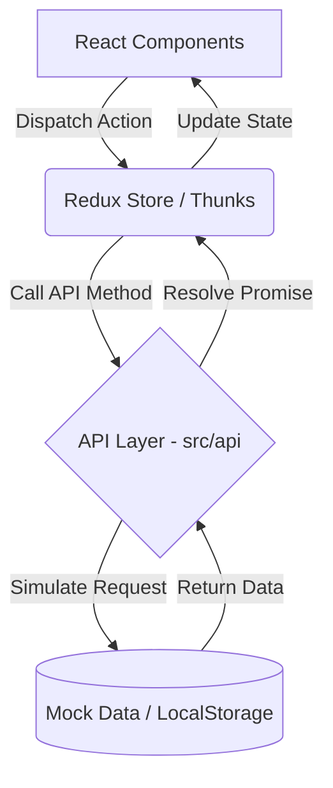

# 🎟️ GOPASS - Premium Event Management Platform

<div align="center">


**A next-generation event discovery and management platform with stunning animations and premium UI/UX**

[](https://reactjs.org/)
[](https://vitejs.dev/)
[](https://redux-toolkit.js.org/)
[](https://tailwindcss.com/)

</div>

---

## 📋 Overview

GOPASS is a premium event management platform where users can discover college events and digital passes, and organizers can manage events. Built with React 19, Vite, and Redux Toolkit, it prioritizes visual excellence with advanced animations (GSAP, Framer Motion, Three.js).

## ✨ Core Features

- **Event Discovery:** Browse hackathons, workshops, cultural fests.
- **Smart Validations:** Role-based access control (USER, ORGANIZER, ADMIN).
- **Premium UI/UX:** Glassmorphism, 3D Hero background, smooth page transitions.
- **Digital Passes:** Generate and manage event passes.

## 🔄 Application Data Flow

GOPASS follows a centralized state management and API abstraction pattern, ensuring a seamless data flow from the UI to the data layer:

1. **User Interaction (`src/pages`, `src/components`)**
   Users interact with the React components. Actions (like logging in or fetching events) trigger Redux dispatches.
   
2. **State Management (`src/store/slices`)**
   Redux Toolkit uses `createAsyncThunk` to intercept async actions. It manages the global state for Authentication (`authSlice`) and Events (`eventsSlice`).

3. **API Layer Abstraction (`src/api`)**
   Redux thunks call localized API functions (e.g., `eventsApi.js`, `authApi.js`). This layer abstracts the data source.

4. **Data Persistence / Backend Mock (`src/mocks`)**
   Currently, the API layer resolves using simulated asynchronous delays and mock data, saving transient state in `localStorage` (e.g., `'gopass_user'`).
   *Note: Real backend integration will simply replace the mock logic inside the `src/api` files without affecting components or state logic.*

5. **UI Update**
   Once the API responds, the Redux store updates, triggering a reactive re-render of the relevant React components.



## 🚀 Tech Stack

- **Frontend:** React 19.2.0, Vite 7.2.4
- **State Management:** Redux Toolkit
- **Animations:** GSAP 3.14.2, Framer Motion, Lenis (Smooth Scroll), Three.js
- **Styling:** TailwindCSS 3.4.19, PostCSS

## 📦 Installation & Setup

1. **Clone the repository**
   ```bash
   git clone https://github.com/Aman-Bahuguna/GOPASS.git
   cd GOPASS
   ```

2. **Install dependencies**
   ```bash
   npm install
   ```

3. **Start the development server**
   ```bash
   npm run dev
   ```

## 📁 Project Structure

```text
GOPASS/
├── public/              # Static assets and event images
├── src/
│   ├── api/             # API abstraction layer (Mocks & Fetch logic)
│   ├── assets/          # Brand assets and images
│   ├── components/      # Reusable UI, blocks, and canvas components
│   ├── context/         # React Contexts (e.g., AuthContext wrapper over Redux)
│   ├── mocks/           # Mock API responses and initial data
│   ├── pages/           # Route pages (Landing, Auth, Dashboards)
│   ├── store/           # Redux configurations and slices
│   └── utils/           # Helper functions, constants, and role configs
└── docs/                # Detailed guides (Animations, Transitions, etc.)
```

## 🤝 Contributing

Contributions are welcome. Please ensure your code follows the existing style, includes appropriate Redux logic, and routes API requests through the `src/api` layer.

## 📄 License

This project is licensed under the MIT License.
